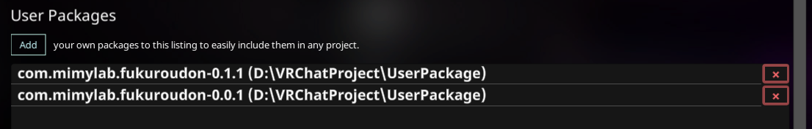
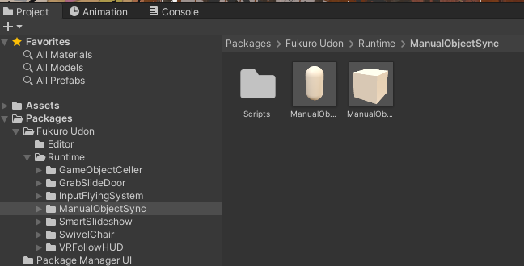

# Fukuro Udon
## 概要
[BOOTHで展開](https://mimyquality.booth.pm/item_lists/rdaT1p1m)しているU#アセット達のおまとめVPMパッケージです。  
個別の内容はこちらを参照してください。

## 導入手順
[Release](https://github.com/mimyquality/FukuroUdon/releases)または[こちら](https://mimyquality.github.io/FukuroUdon/)からzipファイル( *com.mimylab.fukuroudon-\*.\*.\*.zip* )をダウンロードしてください。  

ダウンロードしたzipファイルを適当なフォルダーに解凍し、VCC(VRChat Creator Companion)のSettingsにある *User Packages* の「Add」ボタンから、解凍したパッケージフォルダーを含むフォルダーを指定します。  
パッケージ一覧にFukuroUdonパッケージが追加されていれば成功です。  

**注意：** VPM版Fukuro Udonパッケージをインポートする前に、[BOOTH版アセット](https://mimyquality.booth.pm/item_lists/rdaT1p1m)からインポートしたものは予め削除しておいてください。

VCCから任意のプロジェクトを選択し、パッケージリストの *Multiple Repos Serected* から *Local User Packages* にチェックしてください。  
読み込んだユーザーパッケージが一覧に出てくるので、 **Fukuro Udon** の「Add」ボタンを押してプロジェクトにインポートします。  

## 利用方法
パッケージは *Assets* フォルダーではなく *Packages* フォルダーに展開されるようになります。サンプルPrefabもここに含まれています。  
また、特定のU#スクリプトを決め打ちで使いたい場合は、付けたいオブジェクトの「Add Component」ボタンからスクリプト名で検索してアタッチするのでもOKです。  

## 更新履歴

## ライセンス
Copyright (c) 2022 Mimy Quality  
Released under the MIT license  
https://opensource.org/licenses/mit-license.php