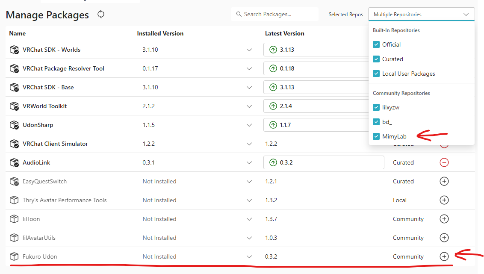

# Fukuro Udon

## 概要

[BOOTHで展開](https://mimyquality.booth.pm/item_lists/rdaT1p1m)しているU#アセット達のおまとめVPMパッケージです。  
個別の内容は[こちら](https://github.com/mimyquality/FukuroUdon/wiki)を参照してください。

## 導入手順

VCC(VRChat Creator Companion)をインストール済みの場合、以下の**どちらか一つ**の手順を行うことでMimyLabのリポジトリーをインポートできます。

- https://vpm.mimylab.com/ へアクセスし、「Add to VCC」から`https://mimyquality.github.io/VPM-Repository/index.json`を追加
- VCCのウィンドウで`Setting - Packages - Add Repository`の順に開き、`https://mimyquality.github.io/VPM-Repository/index.json`を追加


[VPM CLI](https://vcc.docs.vrchat.com/vpm/cli/)を使用してインポートする場合、コマンドラインを開き以下のコマンドを入力してください。

```
vpm add repo https://mimyquality.github.io/VPM-Repository/index.json
```


VCCから任意のプロジェクトを選択し、「Manage Project」から「Manage Packages」に移動します。  
読み込んだパッケージが一覧に出てくるので、 **Fukuro Udon** の右にある「＋」ボタンを押すか「Installed Version」から直接バージョンを選ぶことで、プロジェクトにインポートします。  



リポジトリーを使わずに導入したい場合は、[Release](https://github.com/mimyquality/FukuroUdon/releases)からunitypackageファイル( *com.mimylab.fukuroudon-\*.\*.\*.unitypackage* )をダウンロードして、プロジェクトにインポートしてください。  

**注意：** VPM版Fukuro Udonパッケージをインポートする前に、[BOOTH版アセット](https://mimyquality.booth.pm/item_lists/rdaT1p1m)からインポートしたものは予め削除しておいてください。

## 利用方法

パッケージは *Assets* フォルダーではなく *Packages* フォルダーに展開されるようになります。サンプルPrefabもここに含まれています。  
また、特定のU#スクリプトを決め打ちで使いたい場合は、付けたいオブジェクトの「Add Component」ボタンからスクリプト名で検索してアタッチするのでもOKです。  


## 更新履歴

[CHANGELOG](Packages/com.mimylab.fukuroudon/CHANGELOG.md)

## ライセンス

[LICENSE](Packages/com.mimylab.fukuroudon/LICENSE.md)